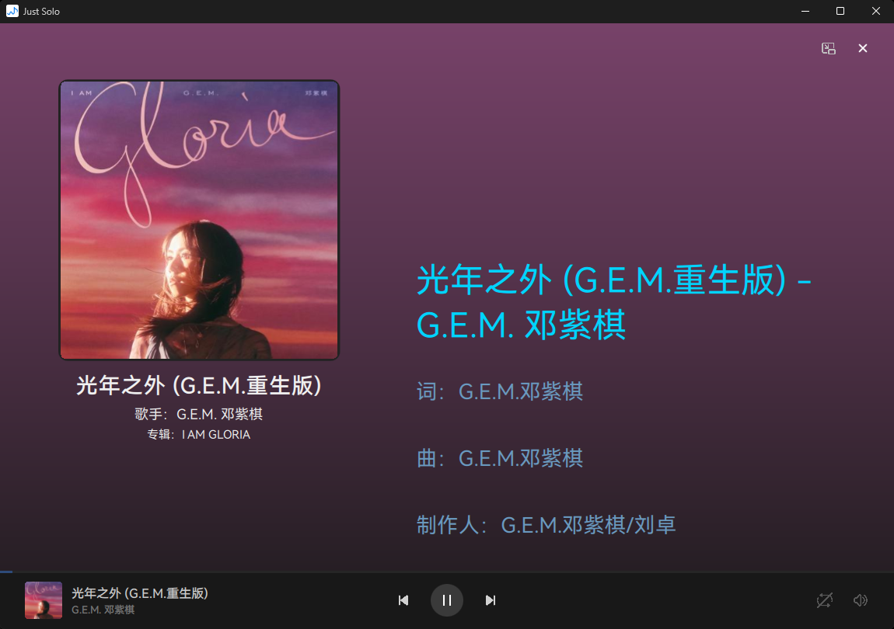
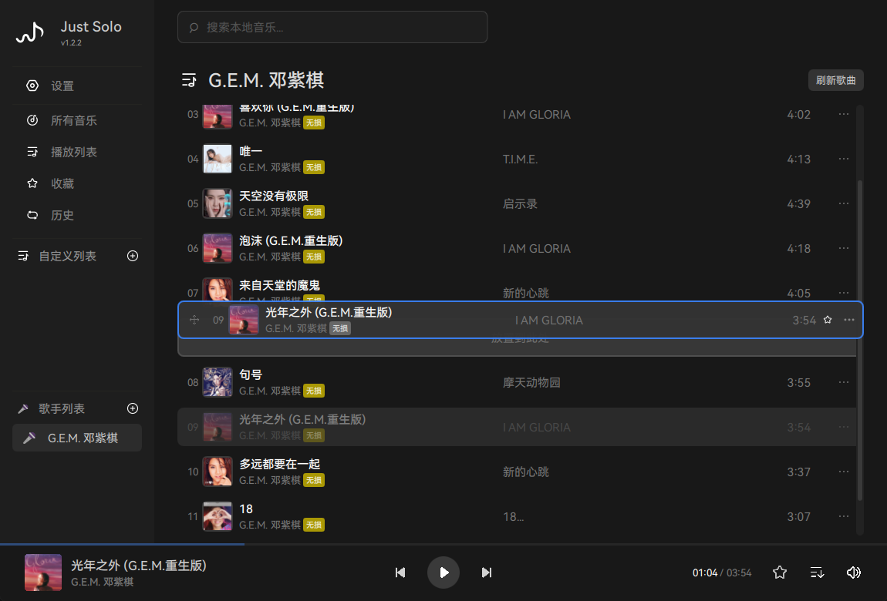

<h1 align="center">Just Solo</h1>
<div align="center">


**Just Solo** —— 纯粹轻量的本地音乐播放器

[](https://www.qt.io)
[](https://isocpp.org)
[](https://doc.qt.io/qt-6/qmlapplications.html)
[](https://cmake.org)
[](LICENSE)
[](https://www.microsoft.com/windows)



</div>

<table>
  <tr>
    <td></td>
    <td></td>
  </tr>
</table>

> PS：本示范图片仅用于展示功能，歌曲版权属于原作者

---

## 项目简介

> **作者**：ZZJ-JACK ([zzjjack.us.kg](https://zzjjack.us.kg))  
> **官方网站**：[https://justsolo.zzjjack.us.kg](https://justsolo.zzjjack.us.kg)  
> **仓库**： [GitHub](https://github.com/ZZJ-jack/Just-Solo) | [GitCode(镜像仓库)](https://gitcode.com/ZZJ-JACK/Just-Solo)
> （本项目只在Github和GitCode上发布，其他渠道均非官方仓库，请不要轻信其他渠道的代码）

Just Solo 是一款追求简洁、高性能的本地音乐播放器。采用 C++ 高性能核心 + QML 现代界面，无 Electron 依赖，内存占用低，冷启动迅速。

原生支持 Windows SMTC 系统媒体控件和 Just Solo LyricServer 媒体信息传输协议（基于 WebSocket），深度适配 [NSD 灵动岛](https://github.com/GEORGEWWWU/NetSpeed-Dynamic)（由 [Ryenryen](https://github.com/GEORGEWWWU) 开发）。

目前仅支持 Windows 平台，专注于纯本地音乐播放。内置基于 libcurl 的 OTA 在线更新功能，支持检查更新并下载安装最新版本。请前往 [Releases](releases) 下载最新安装包。

本项目的知识产权说明、免责声明等详见文末。

---

## 性能

| 指标         | 数值            | 说明                                           |
| ------------ | --------------- | ---------------------------------------------- |
| 平均内存占用 | < 150MB         | vs Electron 类播放器 500MB+                    |
| 冷启动       | < 0.5s          | 无 Electron 依赖，纯原生启动                   |
| 元数据解析   | 快路径 ~1ms/文件    | `MetadataReader` 二进制解析，批处理 10 文件/轮 |
| 歌词缓存     | 零分配          | QVariantMap 深拷贝 → 纯整数数组预编译缓存      |
| UI 渲染      | 60fps 流畅动画  | 原生 GPU 渲染，Qt Quick 场景图                 |
| 导入处理     | 异步队列不卡 UI | 每轮 10 文件 + QTimer 异步触发              |

*随着功能的增加，内存占用会相应增加。但是退出窗口至系统托盘后，后台进程会自动释放内存*。

---

## 功能

### 音频引擎

- 基于 **miniaudio** 轻量库，替代 Qt Multimedia，解决 24-bit 重采样无声问题
- 支持格式：MP3 / FLAC / WAV / OGG / AAC / M4A / WMA / Opus
- 支持热插拔：设备插拔不中断音乐播放，插回去自动恢复声音
- 使用流式播放，大幅降低内存占用，同时确保支持大文件播放无卡顿
- **原生支持WASAPI 独占 / 共享输出**：播放设置可切换，独占延迟更低、音质更稳定，切换时自动保留播放现场；开启前自动检测音频通道占用情况，被占用时弹窗提示（重新检测 / 关闭独占 / 强制开启）

### 播放控制

- 基本操作：播放 / 暂停 / 停止 / 上一首 / 下一首
- **5 种播放模式**：顺序 / 列表循环 / 单曲循环 / 随机 / 关闭循环，底部控制栏弹窗菜单切换（图标横向展开）
- **进度条**：支持点击拖动 seek，当前时间 / 总时长显示，高亮已播放区域
- **全局快捷键**：默认 `Ctrl+Alt+Space` 播放/暂停，`Ctrl+Alt+←→` 上下首，支持自定义

### 音乐库管理

- **导入方式**：文件对话框多选 / 导入文件夹 / 资源管理器拖放（支持文件与文件夹）
- **自动去重**：同一文件路径跳过；不同文件同一首歌保留音质更高版本；多歌手分隔符统一（`/ ; |｜` → `、`）
- **音乐搜索**：全局搜索，标题/歌手/专辑模糊匹配，关键词青色加粗高亮，结果点击自动定位播放
- 音乐列表五列对齐（封面 / 标题 / 歌手 / 专辑 / 时长），列宽随窗口自适应
- 标题行显示音质标签（极低 / 标准 / 高品质 / 无损 / 高解析 / 母带 / 空间音频）
- **手动拖拽排序**：歌曲列表（音乐库/收藏/自定义列表）支持拖拽排序

### 自定义播放列表

- 侧边栏创建/重命名/删除，列表名仅允许中英文、数字、`-`、`_`，禁止重名
- 右键添加本地音乐，或从音乐库**多选导入**（搜索过滤、勾选、已存在标记）
- 切换播放列表时确认弹窗，跨来源跟踪可选开启
- 右键「删除此歌曲」确认后同步从历史/收藏/播放列表/所有自定义列表删除
- 持久化到 `custom_playlists.json`

### 收藏与历史

- **收藏**：收藏/取消收藏，持久化到 `favorites_cache.json`
- **播放历史**：自动记录，同文件去重，上限 500 条，持久化到 `history_cache.json`
- 播放列表启动自动恢复（`playlist_cache.json`），跳过已删除文件

### 歌词系统

- **外部歌词**：同目录同名 `.lrc` 文件，支持 `[mm:ss]` / `[mm:ss.x]` / `[mm:ss.xx]` / `[mm:ss.xxx]` 四种精度
- **嵌入式歌词**：MP3 / FLAC 精确解析 ID3v2 USLT 帧 / VorbisComment LYRICS 字段
- **双语字幕**：同时间戳自动检测翻译并合并，主歌词 + 翻译双行显示
- **自动高亮**：三色方案（已播=黄 / 当前=青 58px / 未播=灰蓝），丝滑滚动ui
- **歌词预读偏移**：50~350ms 可调（5ms 步长），30ms debounce 防抖更新，默认无偏移

### Windows 系统集成

- **SMTC 系统媒体接口**：任务栏音量弹窗 / 锁屏 / 蓝牙设备显示歌名、歌手、封面，支持系统按键控制
- **NSD 灵动岛深度适配**：每 500ms 推送 Timeline 属性，支持歌词同步显示
- **Just Solo LyricServer协议**：基于 WebSocket（`ws://127.0.0.1:47290`），供第三方客户端获取实时歌词与播放状态
- **系统托盘**：关闭窗口最小化到托盘（可选），音乐后台播放，左键/双击恢复，右键菜单提供显示主窗口 / 退出至托盘 / 迷你模式 / 退出
- **单实例检测**：基于 `QLocalServer`，防止重复启动，托盘隐藏后点快捷方式恢复窗口
- **系统原生标题栏**：DWM 深色自定义，Win11 三色定制（背景/文字/边框），Win10 强制深色主题

### 迷你播放器（迷你小窗）

- 全新独立小窗模式，始终置顶显示
- 沉浸背景：封面取色 + 模糊，跟随当前歌曲封面变化
- 展示专辑封面、歌曲标题（居中放大）及歌手信息
- 支持播放/暂停控制
- 从播放详情页或系统托盘菜单进入
- 一键还原至主窗口

### 播放详情页

- 点击封面打开，底部滑入滑出动画，沉浸背景
- 左侧：圆形封面 + 歌名（超长 marquee 滚动）+ 歌手 + 专辑
- 右侧：逐行高亮歌词（已播/当前/未播三色）
- 底部：可拖动进度条 + 播放模式切换按钮 + 迷你小窗进入按钮

### 设置页面

- **外观设置**：循环模式菜单透明度（30%~100%）、音量控制条透明度（30%~100%）、关闭最小化到托盘开关
- **播放设置**：歌词预读偏移滑块、跨来源跟踪开关、WASAPI 独占模式开关（默认共享，独占延迟更低；开启前自动检测通道占用，被占用时弹窗提示，支持重新检测 / 关闭独占 / 强制开启）
- **快捷键设置**：捕获模式卡片，按下组合键实时生效，独立重置按钮
- **软件更新**：基于 libcurl 的 OTA 在线更新，支持手动检查与下载安装最新版本
- **关于 JustSolo**：作者信息、项目地址、运行环境、LyricServer 协议状态

---

## 技术栈

- **UI**: Qt Quick (QML), Qt QuickControls2, Qt QuickLayouts
- **后端**: C++17, Qt 6.8.3
- **网络**: libcurl (OTA 在线更新)
- **Markdown**: cmark-gfm (Markdown → 富文本 HTML 转换)
- **构建**: CMake 3.16+, Visual Studio 2026 (MSVC)
- **字体**: HarmonyOS Sans SC

---

## 项目结构

```
Just-Solo/
├── CMakeLists.txt              # CMake 构建配置
├── .gitignore
├── LICENSE                     # MIT 许可证
├── README.md
├── CHANGELOG.md                # 版本更新日志
├── 安装说明.txt                 # 安装与部署说明
├── run.ps1                     # 编译 + 部署 + 运行脚本
├── package.ps1                 # 一键打包脚本
├── setup.iss                   # InnoSetup 安装包脚本
├── lyric_client_test.html      # Just Solo LyricServer协议 测试页面（仅作参考，实际延迟需要调试）
├── cmake/
│   └── GenerateVersion.ps1    # 自动生成版本号
├── docs/
│   ├── BugList.txt             # 已知问题列表
│   └── Just-Solo-LyricServer.md # LyricServer 协议文档
├── src/
│   ├── main.cpp                # 程序入口（单实例检测、DWM 标题栏、Tray、SMTC、HotkeyManager）
│   ├── core/
│   │   ├── AudioEngine.h/cpp       # 音频引擎（基于 miniaudio）
│   │   ├── MusicManager.h/cpp      # 音乐管理器（播放/列表/收藏/历史/设置/播放模式）
│   │   ├── MetadataReader.h/cpp    # 元数据快速解析（MP3/FLAC/M4A）
│   │   ├── SMTCManager.h/cpp       # Windows 系统媒体控件（SMTC）
│   │   ├── HotkeyManager.h/cpp     # 全局快捷键管理器
│   │   ├── CurlRequest.h/cpp       # libcurl 网络请求封装
│   │   ├── UpdateChecker.h/cpp     # OTA 在线更新检查
│   │   ├── MarkdownHelper.h/cpp    # Markdown → 富文本 HTML 转换（基于 cmark-gfm）
│   │   └── miniaudio.h             # miniaudio 单头文件库
│   ├── services/
│   │   ├── LyricServer.h/cpp       # LyricServer WebSocket 歌词推送服务
│   └── qml/
│       ├── main.qml            # 主窗口 —— 侧边栏、播放栏、路由控制
│       ├── components/
│       │   ├── NavItem.qml     #   侧边栏主菜单项
│       │   ├── SubNavItem.qml  #   设置页子菜单项
│       │   ├── SongRow.qml     #   歌曲列表行共享组件
│       │   └── MusicListView.qml # 通用歌曲列表组件（列头+列表+滚动+右键/弹窗）
│       └── views/              # 页面（预创建，切换时仅切换 visible，零闪屏）
│           ├── HomePage.qml        # 所有音乐 / 自定义列表（统一组件）
│           ├── PlaylistPage.qml    # 播放列表页
│           ├── FavoritePage.qml    # 收藏页
│           ├── HistoryPage.qml     # 历史页
│           ├── SettingsPage.qml    # 设置页
│           ├── PlayerDetailPage.qml# 播放详情页
│           └── MiniPlayer.qml      # 迷你播放器（迷你小窗）
├── data/
│   ├── image/
│   │   ├── logo.ico / logo.png / logo2.png  # 程序图标
│   │   ├── home.png / mylike.png / mylike-on.png / mylike-off.png / history.png / PlayList.png / AddToPlayList.png # 导航与操作图标
│   │   ├── creatList.png                    # 自建列表图标
│   │   ├── setting.png / menu.png / drag.png # 设置、菜单、拖放提示图标
│   │   ├── mini-enter.png / mini-exit.png # 迷你播放器相关图标
│   │   ├── play.png / playing.png / next.png / prve.png / back.png / volume-logo.png # 播放控制与音量图标
│   │   ├── mode_sequential.png / mode_loop.png / mode_single.png / mode_shuffle.png / mode_stop.png # 播放模式图标
│   │   └── photo-1.png / photo-2.png / photo-3.png / switch.png  # 展示图与切换图标
│   └── font/
│       └── HarmonyOS_Sans_SC_Regular.ttf    # 字体文件（HarmonyOS Sans SC）
├── third_party/
│   ├── curl/                   # libcurl 依赖（bin/include/lib）
│   └── cmark-gfm-0.29.0.gfm.13/ # cmark-gfm 源码（Markdown 解析）
├── resources/
│   └── app.rc                  # Windows 资源文件（嵌入 ico）
└── release/                    # 打包输出目录（由 package.ps1 生成）
```

---

## 构建与运行

### 环境要求

| 依赖          | 说明                      |
| ------------- | ------------------------- |
| Qt 6.8.3      | msvc2022_64               |
| CMake         | 3.16+                     |
| Visual Studio | 2022+ (含 MSVC 工具链)    |
| libcurl       | 项目内置 third_party/curl |

### 配置

```powershell
cmake -B build -G "Visual Studio 18 2026" -A x64 -DCMAKE_PREFIX_PATH="C:\Qt\6.8.3\msvc2022_64"
```

### 编译

```powershell
cmake --build build --config Release
```

### 运行

```powershell
.\run.ps1
```

或直接：（使用已编译好的）

```powershell
& "build\bin\Release\JustSolo.exe"
```

开发者模式（附加控制台）：

```powershell
& "build\bin\Release\JustSolo.exe" --develop
```

### 打包发布

```powershell
# 一键编译 + windeployqt → release/
.\package.ps1
```

---

## 版本更新日志

详见 [CHANGELOG.md](CHANGELOG.md)

---

## FAQ

- **这个项目支持哪些平台？**：
  - 目前仅支持Windows平台，版本为Windows10/11（构建为64位版本）（win7暂未测试）
  - 我们暂时不计划支持其他平台，即使框架原生支持跨平台，因为开发、测试成本较高。
  - 我们欢迎其他平台的贡献，但是目前没有计划支持其他平台。
- **这个项目对比AnyListen等其他音乐播放器有什么区别？**：
  - 这个项目的初衷是为了提供一个纯粹、轻量的音乐播放器。
  - 对比AnyListen等其他使用Electron框架的音乐播放器，我们的项目使用的是Qt框架，聚焦高性能、低占用。
  - 这个项目以本地音乐播放为核心，内置 OTA 在线更新功能（基于 libcurl），不提供音乐下载等网络服务。（推荐使用 LX Music 下载音乐）
- **这个项目会维护多久？**：
  - 我们计划在2026年暑假内完成核心功能，后续大概会进入LTS维护状态。
  - 进入LTS维护状态后，我们不会再有大量新功能同时添加，但我们会继续维护和修复bug。
  - 后续维护会根据用户反馈和需求进行维护，也欢迎各个贡献者参与维护，帮助我们添加新功能。
- **这个项目的代码是否开源？**：
  - 是的，我们的代码是永久开源免费的，我们秉持开源精神，不会将此项目用于商业用途
  - 本项目在 `MIT License` 下开源，在多个平台上提供镜像仓库

---

## 免责声明

1. **版权与许可**  
   本项目及相关代码的著作权受中华人民共和国法律保护，以 **MIT 协议** 开源（详见 `LICENSE` 文件）。  
   在遵守 MIT 协议的前提下，任何人可以**自由使用、修改、复制、分发**本软件，**包括商业用途**，但必须在分发时保留原始版权声明及本许可声明。我们仅要求您在合适的显著位置标注原作者信息（例如 `ZZJ-JACK`），这是您唯一的署名义务。

2. **不提供音乐内容及下载服务**  
   本项目严格遵循中华人民共和国法律，**不提供任何音乐资源的下载、存储或传输功能**。用户若使用第三方软件（如 LX Music 等）获取音乐资源，并将这些资源导入本项目，由此产生的版权责任、侵权风险等，均由用户自行承担，与本项目及作者无关。我们郑重提醒用户：请合法使用音乐资源，仅限用于个人学习、研究或非商业娱乐，不得用于任何可能侵犯他人合法权益的用途。

3. **第三方软件免责**  
   本项目 README 中所有提及或推荐的第三方软件，均由其各自开发者独立维护。用户使用这些第三方软件所造成的一切法律后果（包括但不限于侵权、违规、数据泄露等），本项目和作者不承担任何责任。

4. **法律适用**  
   本项目在中华人民共和国境内运营，所有行为均受中华人民共和国法律管辖。我们承诺项目本身不包含任何违法、侵权或违规内容，但无法保证用户使用方式均符合法律规定。

5. **使用即接受**  
   当您以任何形式使用、修改或分发本项目（或其衍生代码）时，即视为您已阅读、理解并同意本免责声明。在法律允许的最大范围内，作者及贡献者不对因使用本软件造成的任何直接或间接损失承担责任，软件按“现状”（AS IS）提供，不作任何明示或默示的担保。

---

## 开源许可证

MIT License

Copyright (c) 2026 - NOW ZZJ-JACK

Permission is hereby granted, free of charge, to any person obtaining a copy
of this software and associated documentation files (the "Software"), to deal
in the Software without restriction, including without limitation the rights
to use, copy, modify, merge, publish, distribute, sublicense, and/or sell
copies of the Software, and to permit persons to whom the Software is
furnished to do so, subject to the following conditions:

The above copyright notice and this permission notice shall be included in all
copies or substantial portions of the Software.

THE SOFTWARE IS PROVIDED "AS IS", WITHOUT WARRANTY OF ANY KIND, EXPRESS OR
IMPLIED, INCLUDING BUT NOT LIMITED TO THE WARRANTIES OF MERCHANTABILITY,
FITNESS FOR A PARTICULAR PURPOSE AND NONINFRINGEMENT. IN NO EVENT SHALL THE
AUTHORS OR COPYRIGHT HOLDERS BE LIABLE FOR ANY CLAIM, DAMAGES OR OTHER
LIABILITY, WHETHER IN AN ACTION OF CONTRACT, TORT OR OTHERWISE, ARISING FROM,
OUT OF OR IN CONNECTION WITH THE SOFTWARE OR THE USE OR OTHER DEALINGS IN THE
SOFTWARE.
